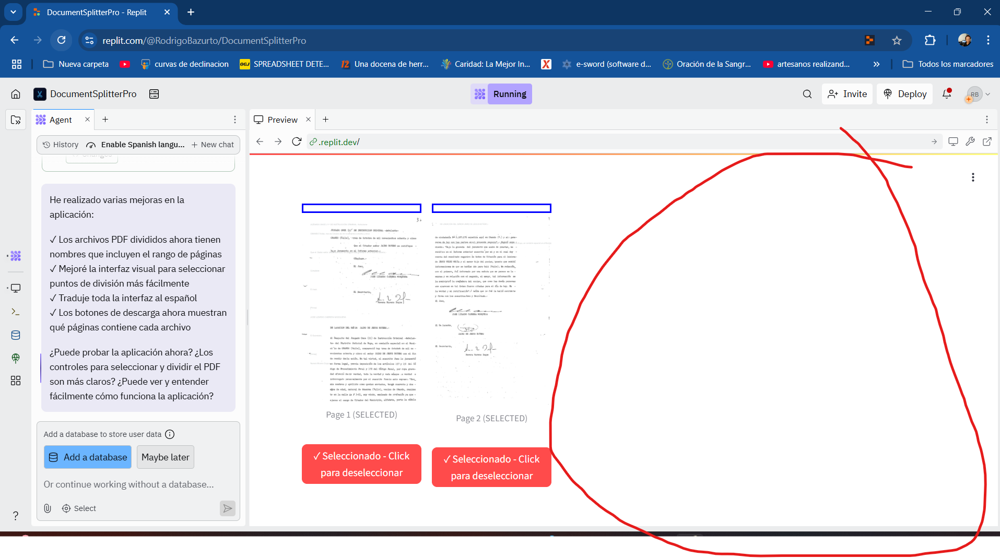
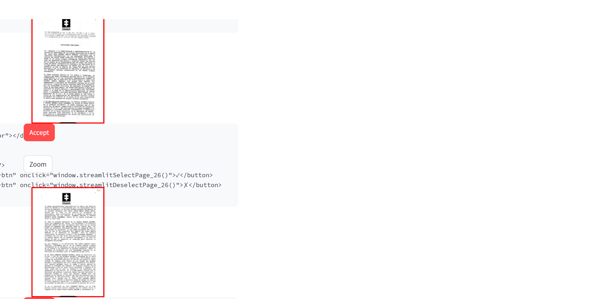
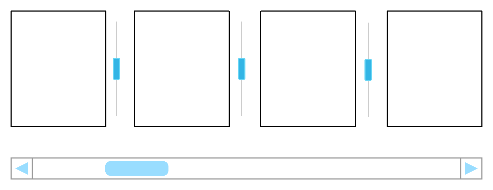
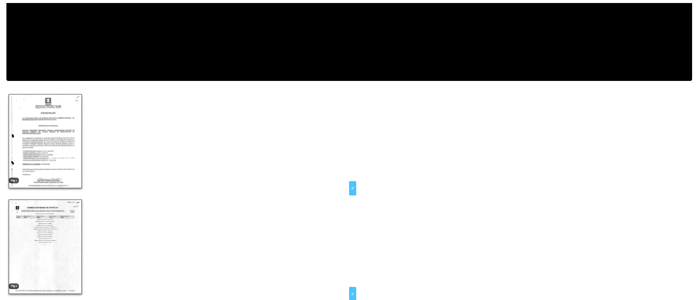
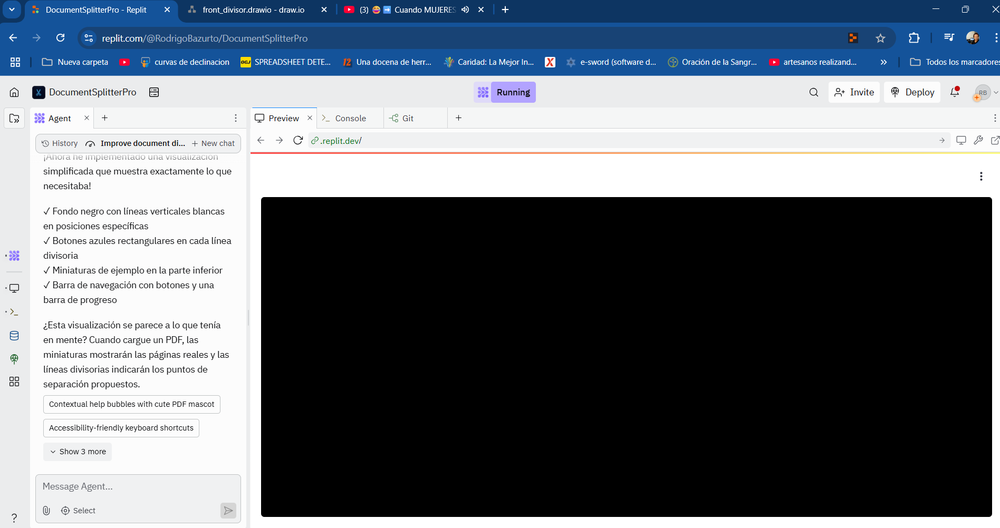

# Manual de Usuario - PDF Splitter App

## Introducción

¡Bienvenido a PDF Splitter App! Esta aplicación le permite dividir documentos PDF extensos en archivos más pequeños de manera intuitiva y eficiente. Ideal para trabajar con documentos legales, contratos, expedientes o cualquier documento PDF que necesite ser segmentado en partes lógicas.

## Características Principales

- Visualización de miniaturas de todas las páginas del PDF
- Detección automática de posibles puntos de división (firmas, sellos, etc.)
- Interfaz intuitiva para aceptar o rechazar puntos de división sugeridos
- Previsualización de las divisiones antes de aplicarlas
- Generación de múltiples archivos PDF con nombres basados en el documento original
- Navegación fácil por documentos extensos

## Comenzando

### Acceso a la Aplicación

La aplicación está disponible a través de un navegador web. No requiere instalación de software adicional.

### Requisitos

- Navegador web moderno (Chrome, Firefox, Edge, Safari)
- Conexión a Internet
- Archivos PDF para procesar

## Guía Paso a Paso

### 1. Carga de Archivos

1. Al abrir la aplicación, verá la pantalla principal con un área para cargar archivos.
2. Haga clic en "Seleccione un archivo PDF" o arrastre y suelte un archivo PDF en el área designada.
3. Una vez cargado, el sistema procesará el documento y mostrará miniaturas de sus páginas.

### 2. Visualización y Navegación

- Las páginas del documento se muestran como miniaturas en la parte central de la pantalla.
- Utilice la barra deslizante debajo de las miniaturas para navegar por el documento si tiene muchas páginas.
- Cada página se muestra con un fondo negro y líneas blancas verticales para facilitar la visualización.

### 3. Puntos de División Sugeridos

- La aplicación analiza automáticamente el documento y sugiere posibles puntos de división, marcados con botones azules.
- Estos puntos suelen corresponder a páginas que contienen firmas, sellos u otros indicadores de final de documento.

### 4. Aceptar o Rechazar Divisiones

1. Para cada punto de división sugerido, aparecerán dos botones:
   - **✓** (Aceptar): Para confirmar que desea dividir el documento en este punto.
   - **✗** (Rechazar): Para indicar que no desea considerar este punto como división.

2. Haga clic en los botones correspondientes según sus preferencias.
3. Los puntos aceptados aparecerán en un listado en la parte inferior.

### 5. División del Documento

1. Una vez que haya aceptado los puntos de división deseados, haga clic en el botón "Dividir PDF" en la parte inferior de la pantalla.
2. La aplicación procesará el documento y creará archivos PDF separados según las divisiones seleccionadas.
3. Se mostrarán enlaces para descargar cada uno de los archivos resultantes.

### 6. Descarga de Archivos

- Haga clic en los enlaces proporcionados para descargar cada archivo PDF dividido.
- Los archivos se nombran siguiendo el patrón: "[nombre_original]_pages[rango].pdf".
  - Por ejemplo: "contrato_pages1-5.pdf", "contrato_pages6-12.pdf", etc.

## Funciones Avanzadas

### Uso de Divisiones Sugeridas

Si desea utilizar todas las divisiones sugeridas automáticamente sin revisarlas una por una:

1. Haga clic en el botón "Usar Sugerencias" que aparece encima de las miniaturas.
2. Todas las sugerencias se marcarán como aceptadas automáticamente.
3. Proceda a dividir el documento como se describe anteriormente.

### Reinicio de Selecciones

Si desea descartar todas las selecciones realizadas y comenzar de nuevo:

1. Haga clic en el botón "Reiniciar" que aparece junto a "Usar Sugerencias".
2. Todas las selecciones se eliminarán y podrá comenzar a seleccionar nuevamente.

## Consejos y Trucos

- **Previsualización mejorada**: Haga clic en el slider de navegación para mover rápidamente entre secciones del documento.
- **Documentos extensos**: La aplicación está optimizada para manejar documentos de más de 300 páginas, pero la carga inicial puede tomar unos momentos.
- **Detección automática**: La detección automática funciona mejor con documentos bien escaneados y con firmas o sellos claramente visibles.
- **Documentos legales**: Para documentos legales, revise cuidadosamente que cada división corresponda al final de un documento o sección.

## Resolución de Problemas

### El archivo no se carga

- Asegúrese de que el archivo sea un PDF válido.
- Verifique que el tamaño del archivo no exceda el límite permitido (generalmente 200MB).
- Intente recargar la página y subir el archivo nuevamente.

### Las miniaturas no se muestran correctamente

- Algunas páginas con formatos muy complejos pueden no visualizarse perfectamente como miniaturas.
- Esto no afecta la calidad del PDF dividido, solo la previsualización.

### La detección automática no identifica los puntos deseados

- La detección automática es una ayuda, pero puede requerir ajustes manuales.
- Utilice los botones de aceptar/rechazar para corregir las sugerencias.

## Contacto y Soporte

Si encuentra algún problema o tiene sugerencias para mejorar la aplicación, por favor póngase en contacto con el soporte técnico a través de:

- Correo electrónico: soporte@pdfsplitterapp.com
- Formulario de contacto en la web: www.pdfsplitterapp.com/contacto

---

Gracias por utilizar PDF Splitter App. ¡Esperamos que esta herramienta facilite su trabajo con documentos PDF extensos!